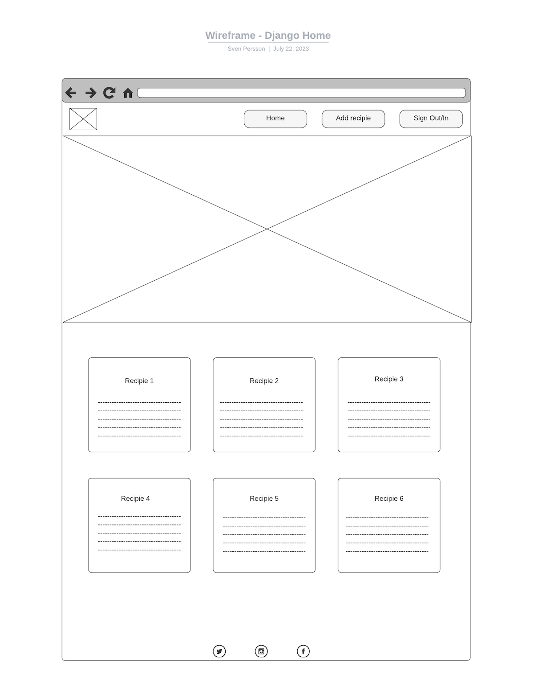
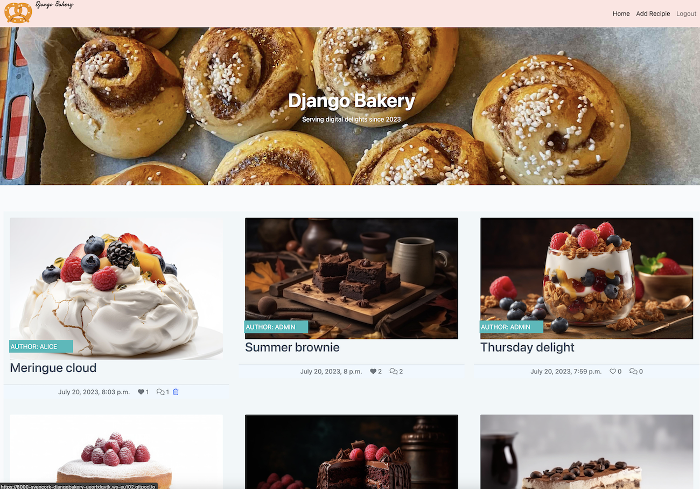

[]

## Table of contents
- [Django Bakery Introduction](#django-bakery-introduction)                                        
- [UX](#ux)
  - [User Stories](#user-stories)
  - [Wireframes](#wireframes)
    - [Home](#home)
    - [My Delights](#my-delights)
    - [Add Recipie](#add-recipie)
    - [Login](#login)
    - [Register](#register)

- [Agile Methodology](#agile-methodology)

- [Technologies](#technologies) 
  - [Languages](#languages)
  - [Frameworks, Hosting Services and IDEs](#frameworks-hosting-services-and-ides)

- [Features](#features)

- [Testing, Validation and Performance](#testing-validation-and-performance)

- [Deployment](#deployment)
  - [Elephant SQL](#elephant-sql)
  - [Cloudinary](#cloudinary)
  - [Heroku](#heroku) 
  - [Forking with GitHub](#forking-with-github)
  - [Cloning with GitHub](#cloning-with-github)

- [Credits](#credits)
  - [Django logo, classes](#django-logo-classes)
  - [Image Credits](#image-credits)

## Django Bakery Introduction
Django bakery is a website for lovers of baked goods to share their recipies and leave feedback to other contributors.
With a registered account users can add, comment, like, edit and delete recipies. 
The live website can be accessed here [Django Bakery](https://django-baker-862762494240.herokuapp.com/).

## UX
### Agile Methodology

[GitHub projectboard](https://github.com/users/sven-cork/projects/10) was used to implement user stories for Django Bakery project. Each user story was provided a label depending of the urgency of implementation: "Must Have", "Should Have", "Could Have" and "Enchancement":

### Wireframes
  #### Home

  #### View Recipie

  #### Add Recipie

  #### Update Recipie

  #### Login

  #### Register

## User Stories
  ### Start Page
  - As a site visitor, it is apparent that the nature of the website is about baking/dessert recipies.
  - As a site user, I can view a list of the most recent recipie posts.
  - As a site user, I can get an overview of the popularity of various recipies based on the
  number of likes.
  - As a site user, I can login or register an account if not already a member.

  ### View Recipie
  - As a site user, to read the ingredients for a recipie, I can view any of the recipies posted on Django Bakery website.
  - As a site user, to express appreciation for a recipie or provide feedback, I can leave a comment using the "Leave a comment" form.
  - As a site user, I can like or unlike a recipie.

  ### Add Recipie Page
  - As a site user, I can add my own recipie setting a recipie title, add ingredients to the "Content" area, select a picture from the "Category" menu and if needed select an allergy warning from the "Allergy" menu.

  ### Update Recipie Page
  - As a site user, I can update any of my recipies using the "Edit" button in order to change the title, add/remove ingredients, change allergy category or image category.

  ### Login Page
  - As a site user, to gain full access to the website I can sign in with a username and a password.

  ### Register Page
  - As a site user, if I do not have a website account, I can sign up providing a username, email address (optional) and password.

  ### Logout Page
  - As a site user, I can select to logout of my django bakery account, confirming with a "Sign Out" button.

## Features

  ### Home Page
  ___

  Recipies submitted by registered site users are displayed on the home page. The home page is paginated with a break point of 9 recipies
  per page, which I believe provides a good balance providing sufficient content howeve avoids a cluttered feel. 
  Each recipie is depicted with a picture selected by the recipie author from a pre-defined category list at time of recipie creation. 
  Underneath each recipie the number of likes and comments with corresponding icons are displayed. Recipies submitted by logged in user also
  displays a trash icon allowing deletion of the recipie.

  

  ### View Recipie
  ___

  After a user selects one of the recipies presented on the Home page, the recipie is displayed
  with the following details:
  - Title.
  - Recipie ingredients.
  - Recipie picture.
  - Allergy information either in red indicating an allergen is present, or green where no allergen
    was selected by recipie author.
  - Heart shaped button for user to like the recipie.
  - Edit button if user is also recipie author.
  - Comment icon indicating number of commments.
  - Comments form to leave recipie feedback with a "Submit" button.
  - Comment section where comments left by site users are displayed.
  
  

  ### Update Recipie Page
  ___

  Recipie author can udpate any of the items available when first adding the recipie.

  

  ### Add Recipie Page
  ___

  On the Add Recipie page, registered site users can submit their own recpies with the following information:
  - "Title".
  - Recipie ingredients in a "Content" section.
  - Recipie picture selected from a "Category" drop menu.
  - Allergy information selected from an "Allergy" drop menu.
  
  

  ### Login Page
  ___

  Site user can login with a username and password, or register for an account.

  

  ### Logout Page
  ___

  After confirming site user can logout of Django Bakery.

  

## Testing, Validation and Performance

Please refer to helper document [TEST_VALIDATION.md](TEST_VALIDATION.md).

## Technologies

  ### Languages
  - HTML - Hyper Text Markup Language (HTML) for document design display on web servers.
  - CSS - Cascading Style Sheet (css) for styling of documents written in HTML.
  - JavaScript - Scripting language for dynamically control content on a website.
  - Python - General purpose language providing logic to websites created with Django.

  ### Frameworks, Hosting Services and IDEs
  - Django - Python web framework
  - Django Crispy Forms - Python package to style Django forms
  - Git - Tool for source code management
  - GitHub - Cloud based code hosting platform
  - GitPod - Cloud based IDE
  - Heroku - Cloud based platform for deployment of apps
  - ElephantSQL - PostgreSQL database hosting service
  - Cloudinary - Cloud based image and video management solution
  - Gunicorn - Python Web Server WSGI HTTP server
  - Google Fonts - Font source library to import font styles

## Deployment

### Elephant SQL

Elephant SQL was used to host postgres databases and linked with Heroku:

1. Create an Elephant SQL account and login via elephantsql.com.
2. Select 'Create new instance' and choose the free plan 'Tiny Turtle'.
3. Select data center region closest to your geographical location.
4. Select 'Review' and if details are satisfactory select 'Create Instance'.
5. Select the newly created instance and open 'Details' section
6. Copy the postgres URL for this instance for later use with Heroku deployment.

### Cloudinary 

Cloudinary platform was used to host static files and media.

1. To create a Cloudinary account navigate to cloudinary.com.
2. Select 'Sign up for Free' and choose sign up option.
3. Select 'Create Account'.
4. From Cloudinary Dashboard copy 'API Environmental Variable' for later use with Heroku deployment.

### Heroku

Django Bakery was deployed to Heroku as per the below steps:
1. Create a Heroku account and login via id.heroku.com/login.
2. From 'Dashsboard' select 'New' and 'Create new app'.
3. Choose a name for the app and select region (Europe/United States).
4. Select 'Create app'.
5. To apply settings select the "Settings" button.
6. Select "Reveal Config Vars".
7. Add a Key called 'DATABASE_URL' and for the value enter the URL copied from elephantsql.com (Elephant SQL, step: 6.).
8. Add a Key called 'SECRET_KEY' and enter your choise of secret key value.
9. Add a Key called 'CLOUDINARY_URL' and for the value enter the 'API Environmental Variable' copied from cloudinary.com (Cloudinary, step: 4.).
10. Add a key called 'PORT' with a value of '8000'.
11. From the 'Deployment' tab select 'GitHub' in the 'Deployment method' section. Select 'Connect to GitHub' at the bottom of the page.
12. In the search field search for your GitHub repository name.
13. Select 'Connect' to link up with the GitHub repository.
14. Further down the page select deployment method automatic ('Enable Automatic Deploys') or manual ('Deploy branch').

### Forking with GitHub
1. Open [GitHub](https://github.com).
2. Navigate to the intended repository.
3. Select "Fork" in the top rigth corner of the page.
4. Select the owner of the fork repository in the drop menu provided.
5. Select the "Create Fork" button.
6. Your copy of the original repository has been created.

### Cloning with GitHub
1. Open [GitHub](https://github.com).
2. Navigate to the intended repository.
3. Select the "Code" button on the top of the repository page.
4. Select the copy button for one of the three options: "HTTPS", "SSH" or "GitHub CLI".
5. Open Terminal (or command line tool) on your local computer.
6. In Terminal change the current working directory to the directory where the clone will reside.
7. In Terminal type: "git clone" followed by a space. Paste the URL copied in (step 4.).
8. In Terminal press "Enter"/"Return" to create a local copy of the repository on your computer.

## Credits

### Django logo and Hero Image Layout
  Inspiration for the Django logo located in navbar and hero is attributed to [Eleanor Bucke's project 4, "Bhawari Khana"](https://pp4.herokuapp.com/) (on GitHub: https://github.com/eleanorbucke21/PP4).

### Fetch image category from database
  Inspiration to fetch image category from database (models.py) when creating a recipie is attributed to [Tony Albanese's project 4, "BookShelf"](https://ci-project-4-bookshelf.herokuapp.com/) (on GitHub: https://github.com/tony-albanese/ci-project-4).

### Image Credits
  - Strawberry Cake ingredient cover image by [chandlervid85](https://www.freepik.com/free-ai-image/victoria-sponge-cake-isolated-white-background-traditional-london-dessert-ai-generative_43227755.htm#query=strawberry%20cake&position=0&from_view=search&track=ais_ai_generated) on freepik
  - Cinnamon Bun ingredient cover image by [vecstock](https://www.freepik.com/free-ai-image/homemade-baked-dessert-sweet-indulgence-plate-generated-by-ai_41477028.htm#query=cinnamon%20bun&position=1&from_view=search&track=ais_ai_generated) on freepik
  - Danish Pastry ingredient cover image by [vecstock](https://www.freepik.com/free-ai-image/sweet-lemon-slice-gourmet-dessert-plate-generated-by-ai_41307759.htm#query=danish%20pastry&position=4&from_view=search&track=ais_ai_generated) on freepik
  - Cheese Cake ingredient cover image by [chandlervid85](https://www.freepik.com/free-ai-image/homemade-cheesecake-with-fresh-berries-dessert-white-background-ai-generative_43227680.htm#query=Cheese%20Cake&position=2&from_view=search&track=ais_ai_generated) on freepik
  - Chocolate Cake ingredient cover image by [stockgiu](https://www.freepik.com/free-ai-image/fresh-raspberry-chocolate-brownie-rustic-wood-plate-generated-by-ai_43023668.htm#query=chocolate%20cake%20raspberry&position=38&from_view=search&track=ais_ai_generated) on freepik
  - Brulee ingredient cover image by [vecstock](https://www.freepik.com/free-ai-image/gourmet-creme-brulee-with-fresh-fruit-toppings-generated-by-ai_41313132.htm#query=brulee&position=0&from_view=search&track=ais_ai_generated66) on freepik
  - Apple Pie ingredient cover image by [vecstock](https://www.freepik.com/free-ai-image/freshly-baked-apple-pie-sweet-indulgence-generated-by-ai_42212695.htm#query=apple%20pie&position=0&from_view=search&track=ais_ai_generated) on freepik
  - Brownie ingredient cover image by [stockgui](https://www.freepik.com/free-ai-image/dark-chocolate-brownie-stack-rustic-table-generated-by-ai_43114698.htm#query=brownie&position=5&from_view=search&track=ais_ai_generated) on freepik
  - Pancakes ingredient cover image by [vecstock](https://www.freepik.com/free-ai-image/stacked-blueberry-pancakes-wooden-plate-with-syrup-generated-by-ai_41056581.htm#query=pancakes&position=1&from_view=search&track=sph) on freepik
  - Trifle ingredient cover image by [vecstock](https://www.freepik.com/free-ai-image/fresh-fruit-parfait-with-granola-yogurt-generated-by-ai_41417233.htm#query=trifle&position=3&from_view=search&track=ais_ai_generated) on freepik
  - Tiramisu ingredient cover image by [chandlervid85](https://www.freepik.com/free-ai-image/portion-gourmet-tiramisu-italian-dessert-served-plate-gray-table-side-view-ai-generative_43227653.htm#query=Tiramisu&position=1&from_view=search&track=ais_ai_generated) on freepik
  - Muffins ingredient cover image by [freepik](https://www.freepik.com/free-ai-image/gold-elements-birthday-party-cake_42088624.htm#query=muffins&position=19&from_view=search&track=ais_ai_generated) on freepik
  - Eaton Mess ingredient cover image by [chandlervid85](https://www.freepik.com/free-ai-image/pavlova-cake-with-fresh-berry-topping-layers-whipped-cream-meringue-isolated-white-backgroundai-generative_43227483.htm#query=Strawberries%20cream&position=36&from_view=search&track=ais_ai_generated) on freepik
  - Berry Cake ingredient cover image by [vecstock](https://www.freepik.com/free-ai-image/cake-with-berries-it_40996334.htm#query=cake%20with%20cream&position=5&from_view=search&track=ais_ai_generated) on freepik
  - Default picture cover image by [Antonio Quagliata](https://www.pexels.com/photo/happiness-is-a-piece-of-cake-close-up-photography-227432/) on Pexels
  - Gingham table cloth background image by [kjpargeter](https://www.freepik.com/free-vector/red-white-gingham-pattern_2602853.htm#query=table%20cloth&position=1&from_view=search&track=ais) on freepik
  - Django bakery pretzel logo image by [John Sorrentino](https://favicon.io/emoji-favicons/pretzel) on favicon.io/

[def]: TEST_VALIDATION.md