[Go back README.md](README.md)

# Testing, Validation and Performance

## Table of contents

- [Manual Testing](#manual-testing)

- [Browser Compatibility](#browser-compatibility)

- [Device Compatibility](#device-compatibility)

- [Validation and Performance](#validation-and-performance)

- [Bugs](#bugs)

## Manual Testing

  ### Navbar
  ___

  | Action | Expected Behaviour | Pass/Fail |
  |--------|--------------------|-----------|
  | Select "Home" in Navigation bar | Renders Homepage | Pass |
  | Select "Add Recipie" in Navigation bar | Renders Add Recipie page | Pass |
  | Select "Register" in Navigation bar | Renders Register page | Pass |
  | Select "Login" in Navigation bar | Renders Login page | Pass |
  | Select "Logout" in Navigation bar | Renders Logout validation | Pass |
  | Select "Sign Out" button on "Logout" page | Logs out user and renders Homepage | Pass |
  | On "Register" page enter username and password values | Creates new site user | Pass |
  | On "Add Recipie" page enter values for "Title" and "Content", choose a category and select "Update" button  | Adds a new recipie rendered on Homepage | Pass |

  ### Home Page
  ___

  | Action | Expected Behaviour | Pass/Fail |
  |--------|--------------------|-----------|
  | Select a recipie to read content | Renders the recipie selected | Pass |

  ### Add Recipie Page
  ___

  | Action | Expected Behaviour | Pass/Fail |
  |--------|--------------------|-----------|
  | Add title | Title rendered when viewing recipie details | Pass |
  | Add content | Ingredients rendered when viewing recipie details | Pass |
  | Select category | Picture belonging to selected category rendered when viewing recipie details | Pass |
  | Select allergy | Allergy warning rendered when viewing recipie details | Pass |

  ### Update Recipie Page
  ___

  | Action | Expected Behaviour | Pass/Fail |
  |--------|--------------------|-----------|
  | Edit title | Updated title rendered when viewing recipie details | Pass |
  | Edit content | Updated ingredients rendered when viewing recipie details | Pass |
  | Edit category | Picture belonging to edited category rendered when viewing recipie details | Pass |
  | Select allergy | New allergy warning rendered when viewing recipie details | Pass |

  ### Login / Register Page
  ___

  | Action | Expected Behaviour | Pass/Fail |
  |--------|--------------------|-----------|
  | Login with username and password | User successfully logged in to Home page | Pass |
  | Register account | Provide username, password and confirm password. Account created | Pass |
  

## Browser and Device Compatibility
  The following Django Bakery features were tested using Chrome Developer Tools for the devices listed in the table below: login user, open recipie, update recipie, like recipie, delete recipie, register user.

  | Device | Functionality for the following pages: Home, Add Recipie, Login, Logut, Register | Screenshot | Pass/Fail |
  |--------|-----------|---------|----|
  | MacBook Pro M1 13"    | All functionality works as expected | []  | Pass |
  | iPad Air | All functionality works as expected | [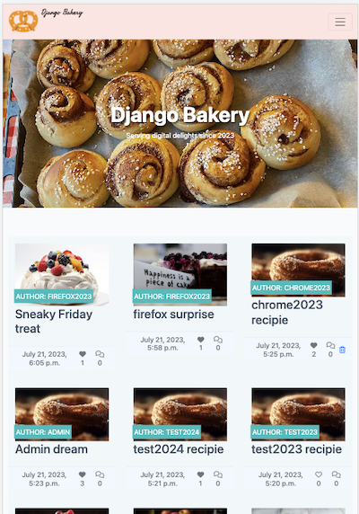]  | Pass |
  | iPhone 12 Pro | All functionality works as expected | [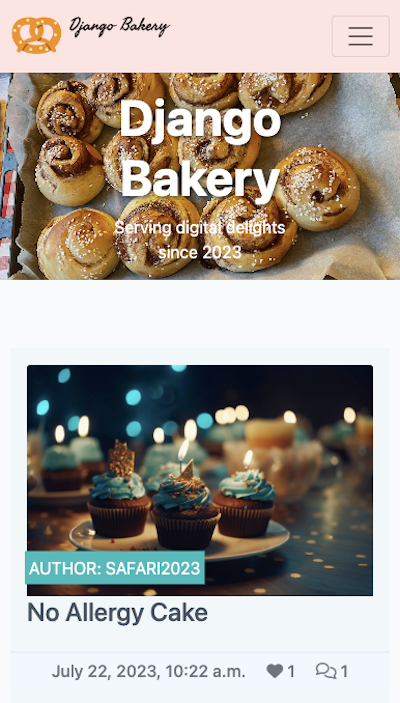]  | Pass |
  | Samsung Galaxy S8+ | All functionality works as expected | [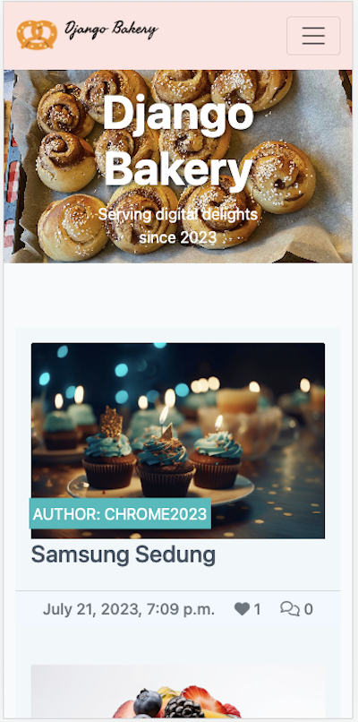]  | Pass |
  

## Browser Compatibility
Browser compatibility was tested manually for Chrome, Safari and Firefox using a MacBook Pro M1 13" as per the table below:

| Browser | Functionality for the following pages: Home, Add Recipie, Login, Logut, Register | Pass/Fail |
  |--------|--------------------|-----------|
  | Chrome | All functionality works as expected | Pass |
  | Safari | All functionality works as expected | Pass |
  | Firefox | All functionality works as expected | Pass |

## Validation and Performance

  ### Lighthouse
  

  
Desktop

   
  
  - Home page

  [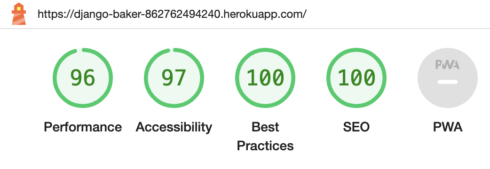]
  ___

  - View Recipie Detauls page

  [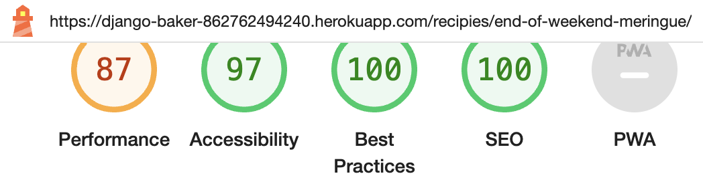]
  ___

  - Add Recipie page

  [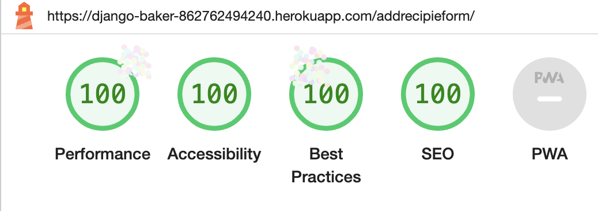]
  ___

  - Update page

  [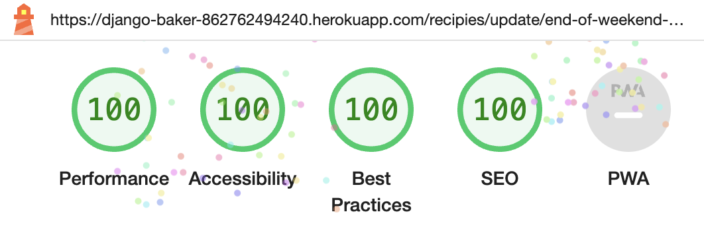]
  ___

  - Register page

  []
  ___

  - Login

  [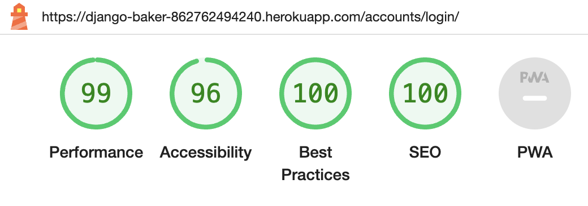]
  ___

  - Logout

  [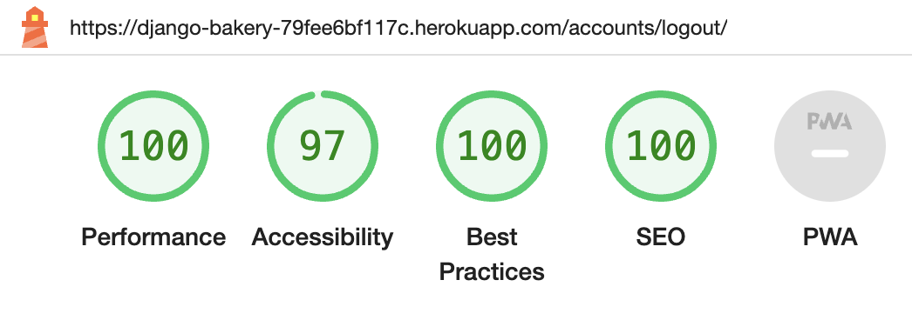]
  ___

 

  

  
Mobile

   
  
  Home page
  [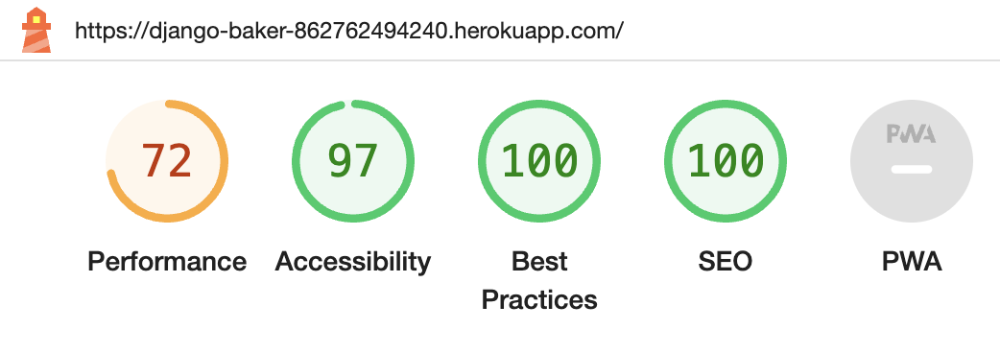]

  View Recipie Details page
  [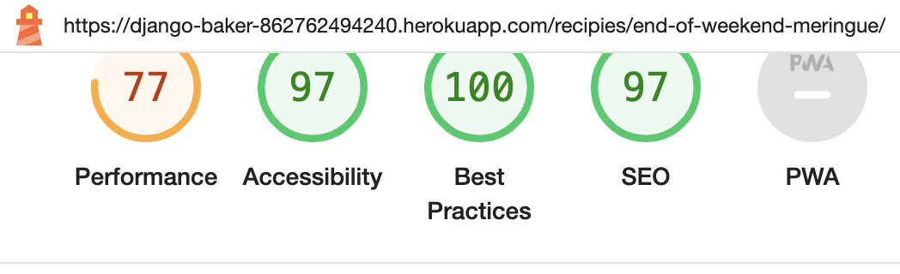]

  - Add Recipie page

  [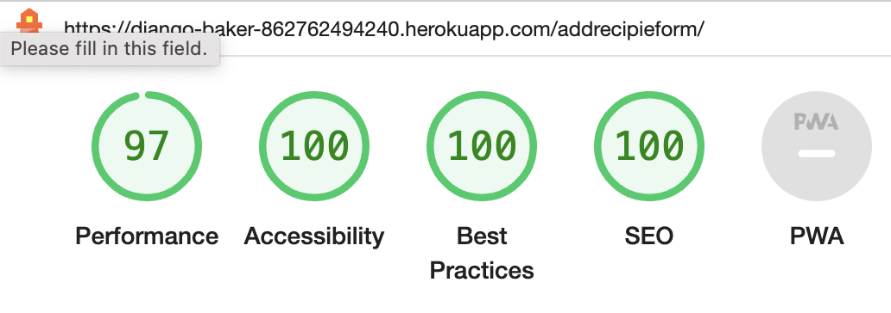]

  - Update page

  [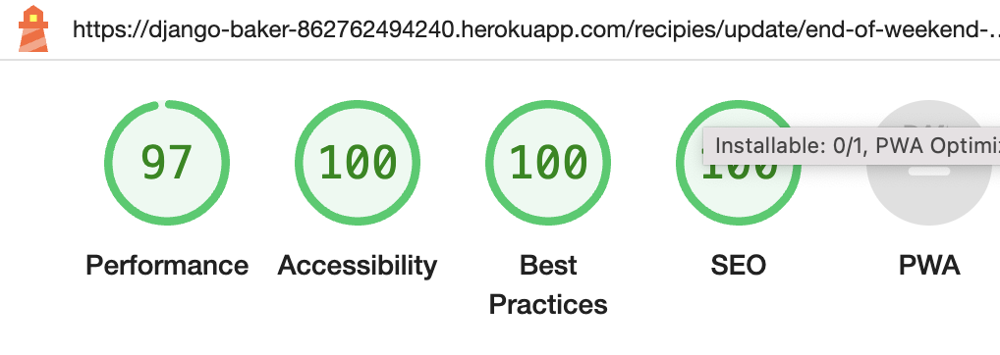]

  - Register page

  [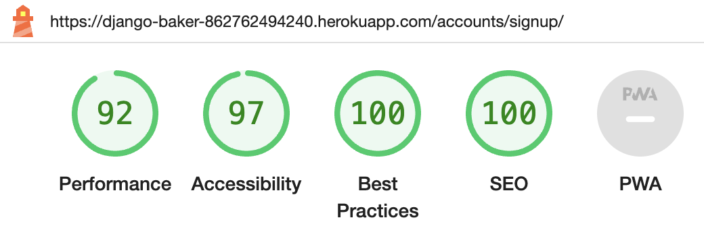]

  - Login
  
  [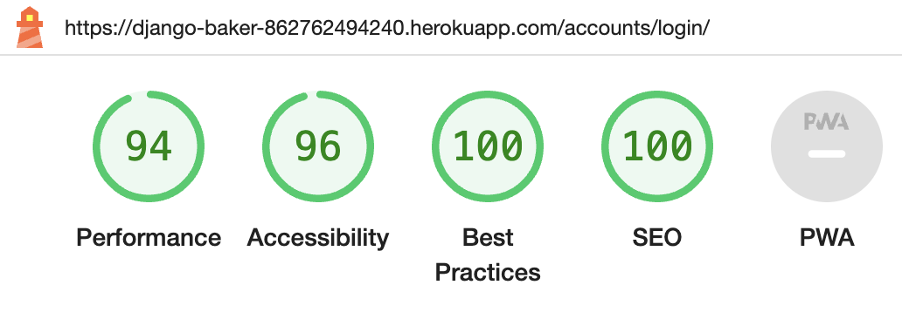]

  - Logout

  [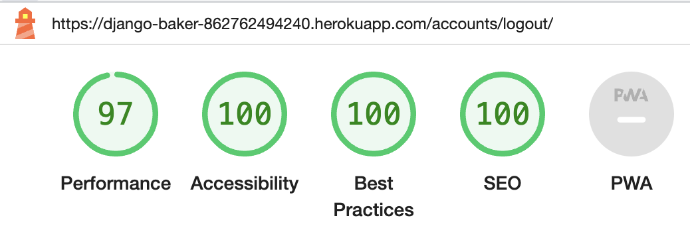]

  

### HTML Validation
 HTML validation was carried out using [W3 NU HTML Checker](https://validator.w3.org/nu/).
  [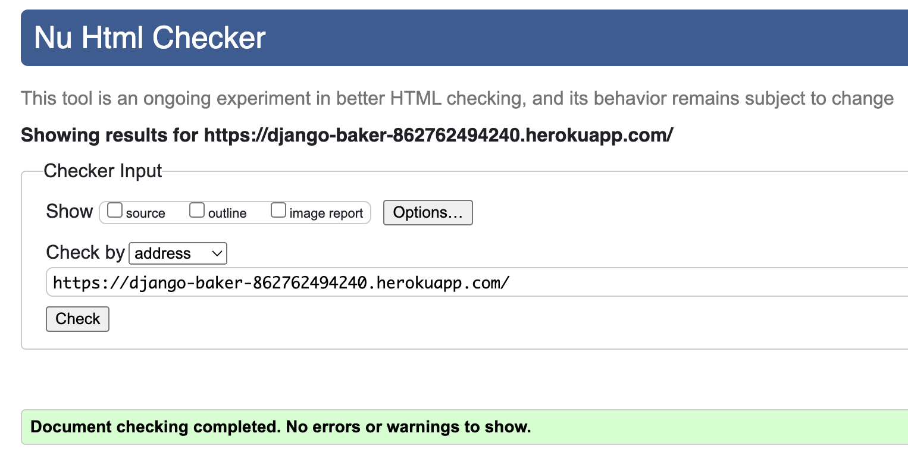]

### CSS Validation
 CSS validation was carried out using [W3C CSS Validator Checker](https://jigsaw.w3.org/css-validator/).
  [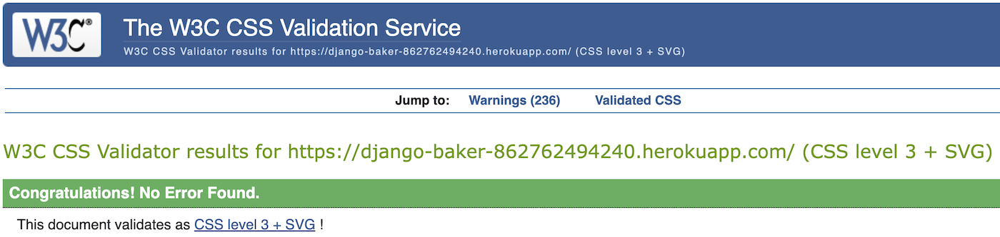]

### JavaScript Validation
 JavaCript validation was carried out using [jshint](https://jshint.com/).
  [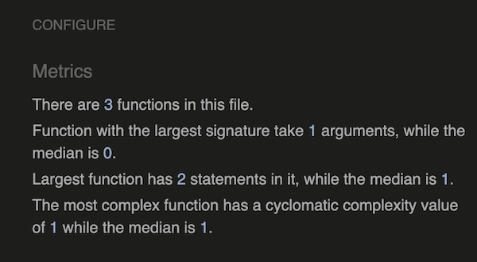]

### Python Validation
  Python testing was carried out using pep8 in GitPod IDE and [CI Python Linter](https://pep8ci.herokuapp.com/).
  No errors reported however several notifications of lines being too long. From researching previous student project work, it is my understanding that this does not indicate invalid code, however a preference of style. 

  

  
Python Validation

   

  | .py file | CI Python Linter Result|
  |--------|--------------------|
  | settings.py | [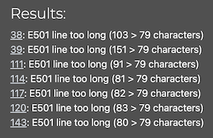] |
  | urls.py | [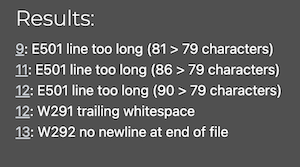] |
  | forms.py | [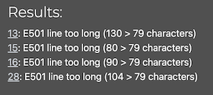] |  
  | models.py | [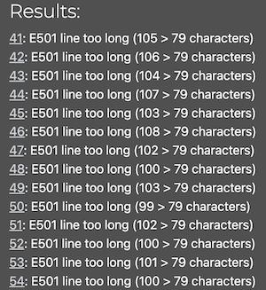] |  
  | views.py | [] |  
  
  
 
  
  ## Bugs
  ___

  - While testing the comment feature in recipie_content.html, adding one comment to a recipie, I noticed the
  comment counter for this recipie had increased with 10 comments despite only one comment being submitted and awaiting admin approval. On the '/admin' page I confirmed 10 comments awaiting approval.
  No changes to the django code was performed in around the time of this issue and I was not able to reproduce the issue. Potentially this may have been linked to ongoing issues with the Wifi network, to which the computer running the cloud based IDE (GitPod) was connected. 
 
  