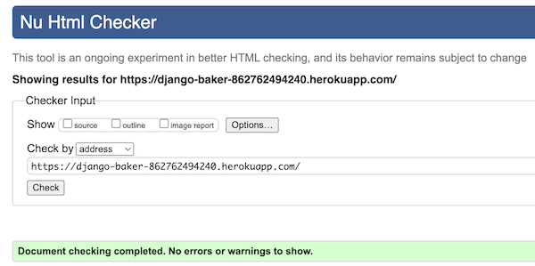
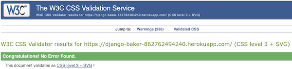
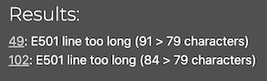

# Testing, Compatibility and Validation
- [Manual Testing](#manual-testing)

- [Browser Compatibility](#browser-compatibility)

- [Validation and Performance](#validation-and-performance)

## Manual Testing

  ### Navbar
  | Action | Expected Behaviour | Pass/Fail |
  |--------|--------------------|-----------|
  | Select "Home" in Navigation bar | Renders Homepage | Pass |
  | Select "Add Recipie" in Navigation bar | Renders Add Recipie page | Pass |
  | Select "Register" in Navigation bar | Renders Register page | Pass |
  | Select "Login" in Navigation bar | Renders Login page | Pass |
  | Select "Logout" in Navigation bar | Renders Logout validation | Pass |
  | Select "Sign Out" button on "Logout" page | Logs out user and renders Homepage | Pass |
  | On "Register" page enter username and password values | Creates new site user | Pass |
  | On "Add Recipie" page enter values for "Title" and "Content", choose a category and select "Update" button  | Adds a new recipie rendered on Homepage | Pass |

  ### Home Page
  | Action | Expected Behaviour | Pass/Fail |
  |--------|--------------------|-----------|
  | Select a recipie to read content | Renders the recipie selected | Pass |

  ### Add Recipie Page
  | Action | Expected Behaviour | Pass/Fail |
  |--------|--------------------|-----------|
  | Add title | Title rendered when viewing recipie details | Pass |
  | Add content | Ingredients rendered when viewing recipie details | Pass |
  | Select category | Picture belonging to selected category rendered when viewing recipie details | Pass |
  | Select allergy | Allergy warning rendered when viewing recipie details | Pass |

  ### Update Recipie Page
  | Action | Expected Behaviour | Pass/Fail |
  |--------|--------------------|-----------|
  | Edit title | Updated title rendered when viewing recipie details | Pass |
  | Edit content | Updated ingredients rendered when viewing recipie details | Pass |
  | Edit category | Picture belonging to edited category rendered when viewing recipie details | Pass |
  | Select allergy | New allergy warning rendered when viewing recipie details | Pass |
  

## Browser Compatibility
 | Browser | Functionality for the following pages: Home, Add Recipie, Login, Logut, Register | Pass/Fail |
  |--------|--------------------|-----------|
  | Chrome | All functionality works as expected | Pass |
  | Safari | All functionality works as expected | Pass |
  | Firefox | All functionality works as expected | Pass |

## Validation and Performance

  ### Lighthouse
  

  
Desktop

   
  
  - Home page

  []

  - View Recipie Detauls page

  []

  - Add Recipie page

  []

  - Update page

  []

  - Register page

  []

  - Login

  []

  - Logout

  []

 

  

  
Mobile

   
  
  Home page
  []

  View Recipie Details page
  []

  - Add Recipie page

  []

  - Update page

  []

  - Register page

  []

  - Login
  
  []

  - Logout

  []

  

### HTML Validation
 HTML validation was carried out using [W3 NU HTML Checker](https://validator.w3.org/nu/).
  []

   

### CSS Validation
 CSS validation was carried out using [W3C CSS Validator Checker](https://jigsaw.w3.org/css-validator/).
  []

   

### JavaScript Validation
 JavaCript validation was carried out using [jshint](https://jshint.com/)
  []

   

### Python Validation
  Python testing was carried out with pep8 in GitPod IDE and [CI Python Linter](https://pep8ci.herokuapp.com/).
  No errors reported however several notifications of lines being too long. From researching previous student project work
  it is my understanding that this does not indicate invalid code, however a preference of style. 

  

  
Python Validation

   

  | .py file | CI Python Linter Result|
  |--------|--------------------|
  | settings.py | [] |
  | urls.py | [] |
  | forms.py | [] |  
  | models.py | [] |  
  | views.py | [] |  
  
  
 
  

  To test 
  ### HTML, CSS and Python validation
  ### Lighthouse
  ### W3C Validation 
  ### Python Validation