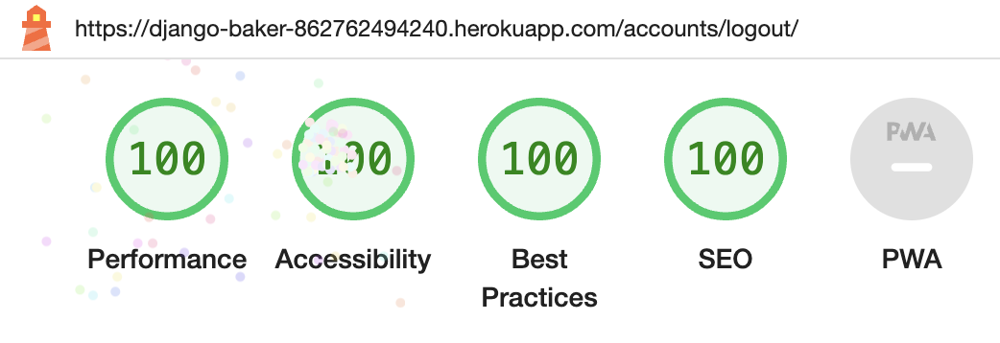
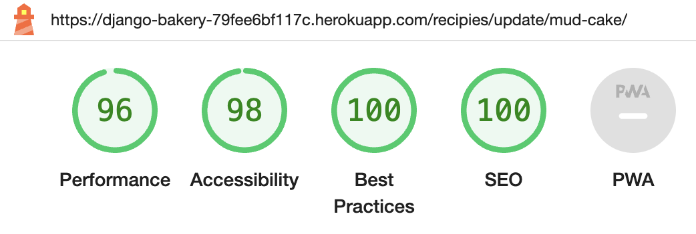

## Testing, Compatibility and Validation
- [Manual Testing](#manual-testing)

- [Browser Compatibility](#browser-compatibility)

- [Validation and Performance](#validation-and-performance)

## Manual Testing

  ### Navbar
  | Action | Expected Behaviour | Pass/Fail |
  |--------|--------------------|-----------|
  | Select "Home" in Navigation bar | Renders Homepage | Pass |
  | Select "Add Recipie" in Navigation bar | Renders Add Recipie page | Pass |
  | Select "Register" in Navigation bar | Renders Register page | Pass |
  | Select "Login" in Navigation bar | Renders Login page | Pass |
  | Select "Logout" in Navigation bar | Renders Logout validation | Pass |
  | Select "Sign Out" button on "Logout" page | Logs out user and renders Homepage | Pass |
  | On "Register" page enter username and password values | Creates new site user | Pass |
  | On "Add Recipie" page enter values for "Title" and "Content", choose a category and select "Update" button  | Adds a new recipie rendered on Homepage | Pass |

  ### Home Page
  | Action | Expected Behaviour | Pass/Fail |
  |--------|--------------------|-----------|
  | Select "Home" in Navigation bar | Renders Homepage | Pass |
  | Select "Add Recipie" in Navigation bar | Renders Add Recipie page | Pass |
  | Select "Register" in Navigation bar | Renders Register page | Pass |
  | Select "Login" in Navigation bar | Renders Login page | Pass |
  | Select "Logout" in Navigation bar | Renders Logout validation | Pass |
  | Select "Sign Out" button on "Logout" page | Logs out user and renders Homepage | Pass |
  | On "Register" page enter username and password values | Creates new site user | Pass |
  | On "Add Recipie" page enter values for "Title" and "Content", choose a category and select "Update" button  | Adds a new recipie rendered on Homepage | Pass |

## Browser Compatibility
 | Browser | Functionality for the following pages: Home, Add Recipie, Login, Logut, Register | Pass/Fail |
  |--------|--------------------|-----------|
  | Chrome | All functionality works as expected | Pass |
  | Safari | All functionality works as expected | Pass |
  | Firefox | All functionality works as expected | Pass |

## Validation and Performance

  ### Lighthouse
  

  
Desktop

   
  
  - Home page

  []

  - Add Recipie page

  []

  - Update page

  []

  - Register page

  - Login

  - Logout

    []

  

  

  
Mobile

   
  
  - Home page

  []

  - Add Recipie page

  []

  - Update page

  []

  - Register page

  - Login

  - Logout

    []

  

  To test 
  ### HTML, CSS and Python validation
  ### Lighthouse
  ### W3C Validation 
  ### Python Validation